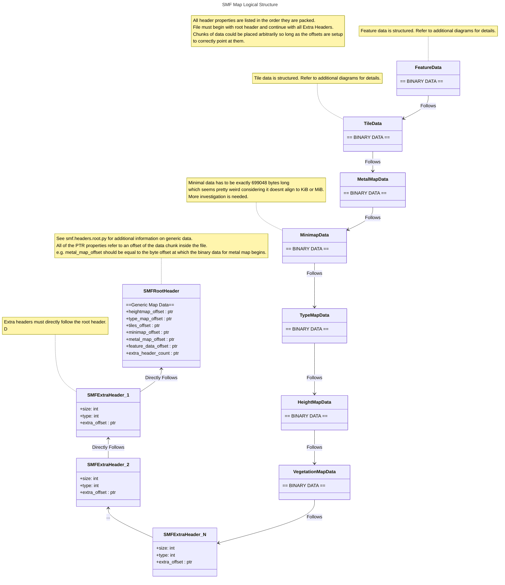

# SMF File Structure
This document outlines the structure of the spring map format file. It shows how the map data is packed into the binary
representation as is expected by the sprint engine.

# Header structure
SMF map file is made up of bits of structured data called "headers" which all have fixed structure. The chunks are
serialized into the binary format and are placed in the file.
Different headers can have links to different chunks of binary data through offsets specified in the header.
For example, the root header of the map has a few links to additional headers which are set through offsets.

In order to specify additional information, SMF uses `ExtraHeader`s which have a well-known size.
These headers must directly follow the root header. In order for the engine to know the exact amount
of headers to read, `extra_header_count` property has to be set on the root header.

Note that the order of binary data chunks in the map is arbitrary.
The chunks on the diagram are presented in the way they currently are packaged by the
map compiler. The overall structure of the map is as follows.

